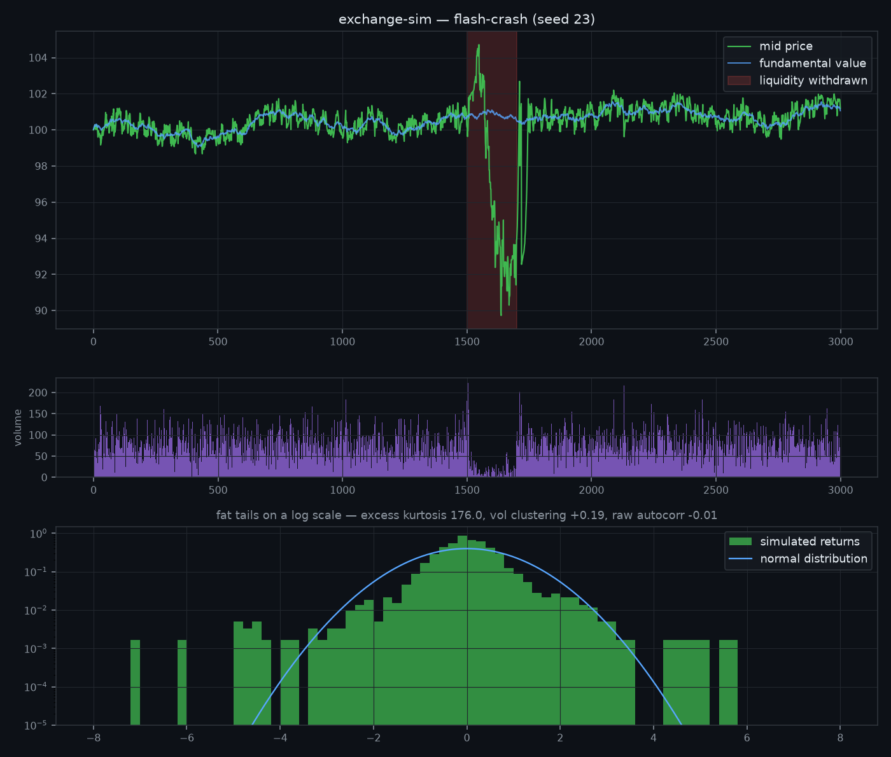

# 🏛️ exchange-simulator

**An agent-based stock market where realistic behavior *emerges*.** Market makers, noise traders, momentum chasers and fundamentalists trade against each other on a real price-time priority matching engine (from [quantsim](https://github.com/hilothefunnydog123-coder/quantsim)). Nobody programs the market to have fat tails, volatility clustering, or flash crashes — those properties **emerge from the interaction**, and the test suite statistically verifies all three.



*One simulated flash crash. When liquidity providers step away (red band) while a forced seller keeps hitting the book, price gaps −10% and volume dries up — then V-recovers the moment providers return. No agent decided to crash the market; the crash is what the system does when liquidity leaves. Note the returns histogram: heavy tails vs the normal curve, on a log scale.*

## 🚀 Quickstart

```bash
pip install "exchange-simulator[plot] @ git+https://github.com/hilothefunnydog123-coder/exchange-simulator.git"

exchange-sim --steps 4000 --seed 42 --plot market.png
exchange-sim --scenario flash-crash --plot crash.png
```

```
exchange-sim — default · 21 agents · 4,000 steps · seed 42

Stylized facts (real markets: >0, >0, ≈0)
  excess kurtosis      +3.02
  vol clustering (L1)  +0.230
  raw autocorr (L1)    +0.015

Accounting (must be invariant)
  total cash       710,000.00
  total shares     2,200
```

## 🧠 The agent zoo

Four interpretable archetypes are enough for a market to come alive:

| Agent | Role | What it contributes |
|---|---|---|
| **MarketMaker** | quotes both sides around mid, skews quotes against inventory (the Avellaneda–Stoikov intuition in one line) | the spread, and shock absorption |
| **NoiseTrader** | random market/limit orders, exponentially scattered limit prices | background flow — and the deep "stub quotes" crash prints hit |
| **MomentumTrader** | market-buys rallies, market-sells dips | amplification → volatility clustering |
| **FundamentalTrader** | leans against deviations from a slow-moving fair value | anchoring → prices don't wander off to infinity |
| **Liquidator** (scenario) | a forced sale that keeps selling regardless of price | the May 6, 2010 trigger |

Every fill is settled **double-entry** between maker and taker. Total cash and total shares across all agents are exact invariants — tested, including straight through a flash crash. If this exchange ever "prints" money, the suite fails.

## 🔬 What the tests actually verify

This is the interesting part: the suite asserts *statistical properties of emergent behavior*, averaged across seeds so it tests the mechanism rather than one lucky run.

1. **Fat tails** — excess kurtosis of returns > 0 (real equity returns: strongly leptokurtic)
2. **Volatility clustering** — |returns| are autocorrelated (calm follows calm, storm follows storm)
3. **No free momentum** — raw return autocorrelation ≈ 0 (you can't get rich reading the tape)
4. **Anchoring** — median gap between price and fundamental stays bounded
5. **The flash-crash double experiment** — the *same* sell program is run twice: with liquidity providers present (mild dip) and with them withdrawn (crash > 2%, deeper than baseline, V-recovery). The crash needs **both** ingredients — exactly the finding of the SEC/CFTC report on May 6, 2010.
6. **Conservation** — cash and shares invariant; wealth marked at a common price is zero-sum

These mirror the classic "stylized facts of asset returns" (Cont, 2001). Parameters were calibrated so the default market lands in empirically realistic ranges — excess kurtosis ~3, clustering ~+0.2, raw autocorrelation ~0.

## 🧪 Run your own experiments

```python
from exchange_sim import Exchange, MarketMaker, NoiseTrader, MomentumTrader, stylized_facts

# what happens to a market with NO fundamental anchor?
agents = [MarketMaker("mm"), *[NoiseTrader(f"n{i}") for i in range(10)],
          *[MomentumTrader(f"m{i}") for i in range(6)]]
tape = Exchange(agents, seed=1).run(5_000)
print(stylized_facts(tape.returns()))   # spoiler: it trends off a cliff
```

Write a new `Agent` subclass (one `act()` method), drop it in, and measure how it changes the market. That's the whole point of the lab.

## ✅ Tests

```bash
pip install -e ".[dev]" && pytest
```

14 tests: accounting invariants, determinism, market mechanics, the three stylized facts, and the liquidity-withdrawal experiment.

## 📄 License

MIT. Simulated money only — though the lessons about liquidity are uncomfortably real.
