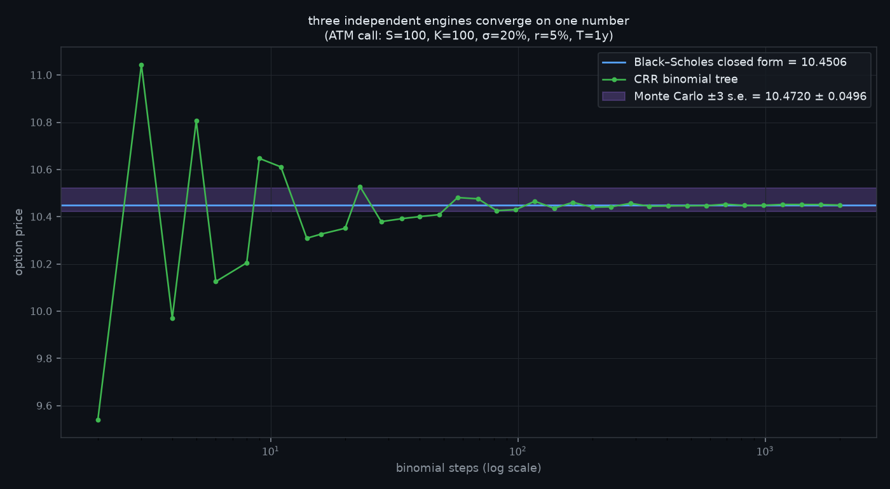

# 🧮 optionslab

**Three independent option pricing engines that must agree.** Black–Scholes closed form (analysis), Cox–Ross–Rubinstein binomial trees (discrete lattice), and Monte Carlo with antithetic variates (stochastic simulation) — sharing no code beyond arithmetic. If three unrelated methods produce the same number to four decimals, the number is right. That cross-validation *is* the test suite.



Plus the full risk toolkit: **all five Greeks** (verified against finite differences), an **implied-volatility solver** (bisection — cannot diverge), **American exercise** via the lattice, and **strategy payoff diagrams** in pure ASCII.

## 🚀 Quickstart

```bash
pip install git+https://github.com/hilothefunnydog123-coder/optionslab.git

optionslab price --kind call --spot 100 --strike 100 --vol 0.20 --rate 0.05 --tte 1
```

```
Price (three independent engines)
  Black–Scholes (closed form)        10.4506
  Binomial CRR European (1000 steps) 10.4486
  Monte Carlo (200,000 paths)      10.4763 ± 0.0234
  Binomial CRR American              10.4486  (early-exercise premium +0.0000)

Greeks
  delta     0.6368     per $1 of spot
  gamma     0.0188     delta change per $1
  vega      0.3752     per vol point
  theta    -0.0176     per calendar day
  rho       0.5323     per 1% of rates
```

That 10.4506 is Hull's textbook value, reproduced to four decimals — and the test suite pins it.

```bash
optionslab payoff butterfly 90 100 110
```

```
                               ██
                              █  █
                             █    █
                            █      █
                           █        █
████████████████████████················████████████████████████
60                                                           140
```

## 🐍 As a library

```python
from optionslab import bs_price, binomial_price, mc_price, greeks, implied_vol

bs_price("put", spot=100, strike=110, rate=0.03, vol=0.25, tte=0.5)
binomial_price("put", 100, 110, 0.03, 0.25, 0.5, american=True)   # early exercise
price, stderr = mc_price("put", 100, 110, 0.03, 0.25, 0.5, seed=42)

greeks("call", 100, 100, 0.05, 0.2, 1.0)["vega"]
implied_vol("call", price=10.45, spot=100, strike=100, rate=0.05, tte=1.0)
```

Conventions are documented in the source (rates continuous, vega per 1.00 vol, theta per year) — because sign conventions are how options people die.

## 🔬 What the 46 tests verify

- **Cross-engine agreement on a 6-point grid** (ATM, deep ITM/OTM, short/long-dated, high vol): binomial(2000) within 0.005 of closed form; Monte Carlo within 3 standard errors
- **Put–call parity** to 1e-10 — the arbitrage relation that must hold no matter what
- **Greeks vs numerical differentiation**: every analytic Greek matches central finite differences of the pricer
- **Implied vol round-trips**: `iv(price(σ)) = σ` to 1e-6, and prices outside no-arbitrage bounds are rejected
- **American exercise economics**: American put > European put; American call = European call *without* dividends (early exercise never optimal — Merton's theorem) but > European *with* them
- **Variance reduction works**: antithetic variates measurably shrink the Monte Carlo error bar
- **Edge cases**: zero vol and zero time collapse all three engines to the same discounted intrinsic value

## 📄 License

MIT. Educational tool — not pricing advice for your actual book.
